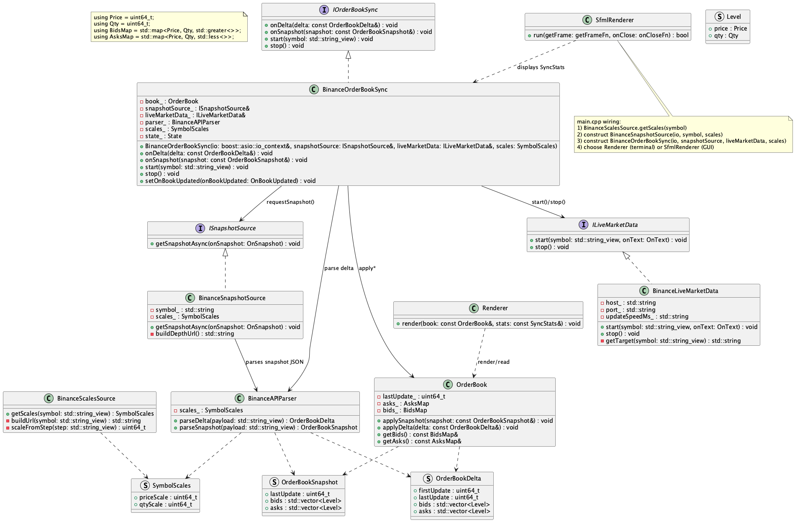
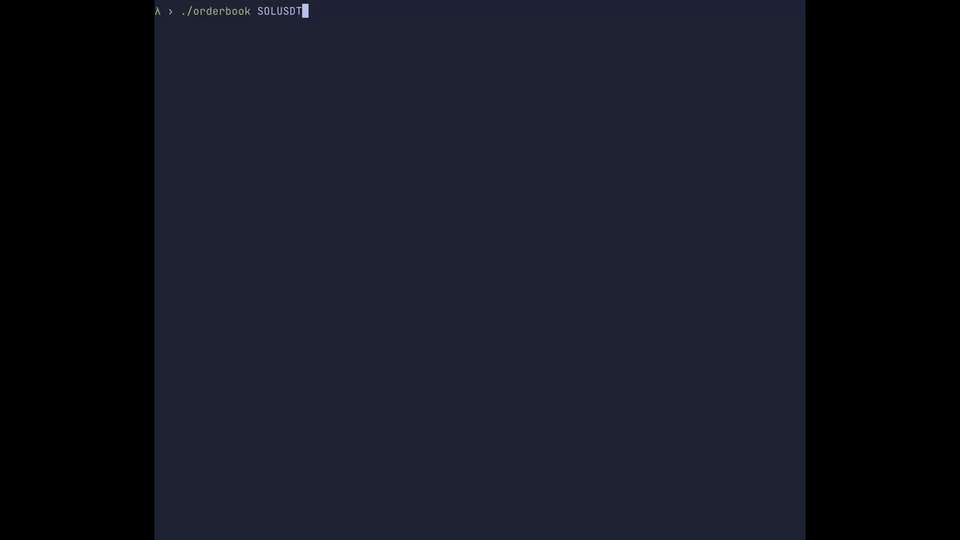
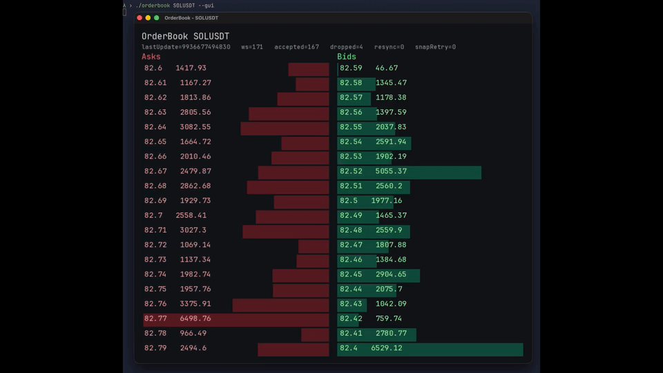

# Futures Order Book Sync (Binance)

Low-latency C++20 local order book synchronizer for Binance USD-M futures.
It keeps a local book consistent using REST snapshot + WebSocket depth deltas, then renders live depth in terminal or SFML UI.

## What This Project Does
- Bootstraps from futures snapshot (`/fapi/v1/depth`) and streams incremental depth updates.
- Maintains local bids/asks with sequencing checks and automatic resync.
- Exposes sync stats (`WS`, `Accepted`, `Dropped`, `Resyncs`, `SnapshotRetries`).
- Provides two views:
  - Terminal renderer
  - SFML renderer (GUI)

## Dependencies
- CMake 3.16+
- C++20 compiler (Clang/GCC/MSVC with C++20 support)
- Boost (JSON + Asio + Beast)
- OpenSSL
- SFML 3 (Graphics, Window, System)

## Build
```bash
cmake . && make -j4
```

## Run
```bash
# Terminal UI (default symbol: BTCUSDT)
./build/orderbook
./build/orderbook ETHUSDT

# SFML UI
./build/orderbook --gui
./build/orderbook ETHUSDT --gui
```

## Local Book Sync Rules
Implementation follows Binance local order book synchronization procedure (snapshot + buffered deltas + sequence validation + restart on gap).

Reference:
- https://developers.binance.com/docs/binance-spot-api-docs/web-socket-streams

Note: this project is futures-focused (`fapi.binance.com` / `fstream.binance.com`), but the sequencing workflow is the same principle that one from Binance docs.

## UML
- Class diagram source: [`uml_class_diagram.puml`](uml_class_diagram.puml)
- Diagram image: [`uml_class_diagram.png`](uml_class_diagram.png)



## Showcase Video
- Terminal demo GIF: [`assets/terminal_demo.gif`](assets/terminal_demo.gif)
- GUI demo GIF: [`assets/gui_demo.gif`](assets/gui_demo.gif)




